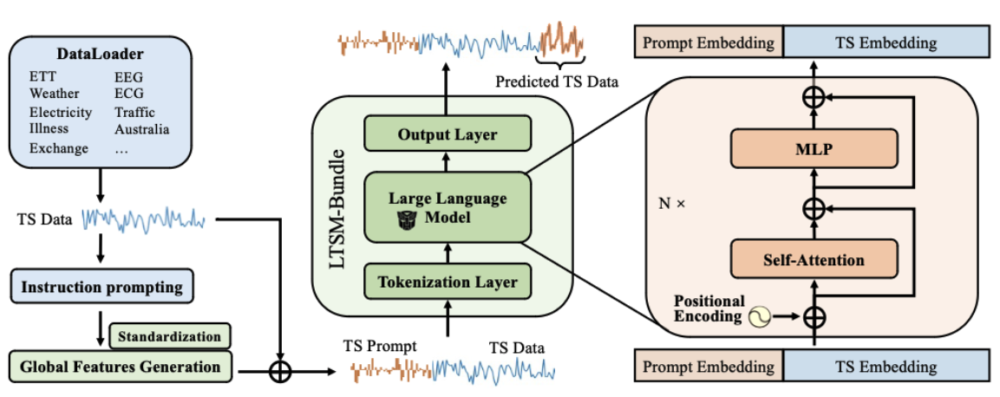

# Understanding Different Design Choices in Training Large Time Series Models


This work investigates the transition from traditional Time Series Forecasting (TSF) to Large Time Series Models (LTSMs), leveraging universal transformer-based models. Training LTSMs on diverse time series data introduces challenges due to varying frequencies, dimensions, and patterns. We explore various design choices for LTSMs, covering pre-processing, model configurations, and dataset setups. We introduce **Time Series Prompt**, a statistical prompting strategy, and $\texttt{LTSM-bundle}$, which encapsulates the most effective design practices identified. Our empirical results show that $\texttt{LTSM-bundle}$ outperforms existing LTSMs and traditional TSF methods in zero-shot and few-shot scenarios on benchmark datasets. $\texttt{LTSM-bundle}$ is developed by [Data Lab](https://cs.rice.edu/~xh37/) at Rice University.

## Resources
:star2: Please stars our repo to follow latest updates of LTSM-bundle!!
:mega: We have released our paper and training code of LTSM-bundle-v1.0!!
* Paper: https://arxiv.org/abs/2406.14045
* Blog: [Time Series Are Not That Different for LLMs](https://towardsdatascience.com/time-series-are-not-that-different-for-llms-56435dc7d2b1)
* Tutorial: [Build your own LTSM-bundle](https://github.com/daochenzha/ltsm/tree/main/tutorial)
* Do you want to learn more about data pipeline search? Please check out our [data-centric AI survey](https://arxiv.org/abs/2303.10158) and [data-centric AI resources](https://github.com/daochenzha/data-centric-AI) !

## Why LTSM-bundle?
The LTSM-bundle package leverages the HuggingFace transformers toolkit, offering flexibility to switch between different advanced language models as the backbone. It is easy to tailor the general LTSMs to their specific time series forecasting needs by selecting the most suitable language model from a wide array of options. The flexibility enhances the adaptability of the package across different industries and data types, ensuring optimal performance in diverse scenarios.

## Installation
```
conda create -n ltsm python=3.8.0
conda activate ltsm
git clone git@github.com:daochenzha/ltsm.git
cd ltsm
pip3 install -e .
pip3 install -r requirements.txt
```

## Quick Exploration on LTSM-bundle 

Training on **[Time Series Prompt]** and **[Linear Tokenization]**
```bash
bash scripts/train_ltsm_csv.sh
```

Training on **[Text Prompt]** and **[Linear Tokenization]**
```bash
bash scripts/train_ltsm_csv.sh
```

Training on **[Time Series Prompt]** and **[Time Series Tokenization]**
```bash
bash scripts/train_ltsm_tokenizer_csv.sh
```

## Datasets and Time Series Prompts
Download the datasets
```bash
cd datasets
download: https://drive.google.com/drive/folders/1hLFbz0FRxdiDCzgFYtKCOPJYSBVvwW9P
```

Download the time sereis prompts 
```bash
cd prompt_bank/propmt_data_csv
download: https://drive.google.com/drive/folders/1hLFbz0FRxdiDCzgFYtKCOPJYSBVvwW9P
```

## Cite This Work
If you find this work useful, you may cite this work:
```
@article{ltsm-bundle,
  title={Understanding Different Design Choices in Training Large Time Series Models},
  author={Chuang*, Yu-Neng and Li*, Songchen and Yuan*, Jiayi and Wang*, Guanchu and Lai*, Kwei-Herng and Yu, Leisheng and Ding, Sirui and Chang, Chia-Yuan and Tan, Qiaoyu and Zha, Daochen and Hu, Xia},
  journal={arXiv preprint arXiv:2406.14045},
  year={2024}
}
```
