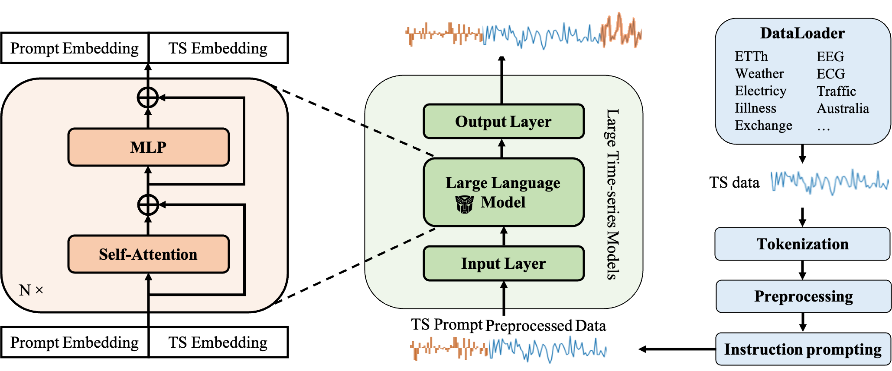

# Large Time Series Model (LTSM)

## Installation
```
conda create -n ltsm python=3.8.0
conda activate ltsm
git clone git@github.com:daochenzha/ltsm.git
cd ltsm
pip3 install -e .
pip3 install -r requirements.txt
```

## Quick start
Get some example data (in datalab1 at Rice):

```
cp -r /home/dz36/ltsm/ltsm/dataset ./
```

Train model on Weather dataset:
```
python main.py --model_id test_run
```

## Datasets
Let's maintain a table of the datasets. We just put datasets in our server for now without uploading to Github.

[EEG (3.4GB)](https://www.physionet.org/content/eegmmidb/1.0.0/)

1526 in total, length 9633

`/home/jy101/ltsm/dataset/eeg_csv/` or `/home/jy101/ltsm/dataset/eeg_feather/`


Pretrain: [ECG (33GB)](https://physionet.org/content/fecgsyndb/1.0.0/)

7000 in total, length 75000

`/home/jy101/ltsm/dataset/fecgsyndb_csv/` or `/home/jy101/ltsm/dataset/fecgsyndb_feather/`

Fine-tune and Testing: [ECG (5GB)](https://physionet.org/content/ecg-arrhythmia/1.0.0/)

45152 in total, length 5000

`/home/jy101/ltsm/dataset/ecg_arrhythmia_csv/` or `/home/jy101/ltsm/dataset/ecg_arrhythmia_feather/`

### Monash

Dataset in 
```
/home/jy101/ltsm/dataset/monash_raw/
```

usage:
```
--data tsf_data --data_path /home/jy101/ltsm/dataset/monash_raw/$DATASET.tsf
```

## Custum Dataset

Data configuration:
```
--data_path: path to the data folder
--data: name of the data loader (i.e. Dataset_Custom_List, Dataset_Custom_List_TS)
```

Data loader:
```
train_loader, val_loader, test_loader = get_data_loaders(config)
```

## Roadmap



### Stage 1

We train the model on some datasets in the same domain to see whether it could work.

Action items:
*   Allen: Focus on modeling. Adapt the code to a form that is more suitable for pre-training and testing/fine-tuning on downstream time series. Note: make it flexible to be able to adapt to fine-tuning. If directly transfer does not work, we may need to try fine-tuning.
*   Guanchu: Focus on efficency. Current task: implement and test data parallel
*   Jiayi: Focus on data. Collect and process data into a format that can be directly loaded by the data loader. Do manual cleaning or filtering if needed.
*   Henry: Provide guidance and trouble shooting. Identifdy the potential good data sources, share time series prerpocessing experiences, etc.
*   Daochen: Design the whole workflow and organize the efforts.

Tentative author order if we submit a paper later:
Allen*, Guanchu*, Jiayi*, Henry*, Daochen*, [some others], Xia Hu

Note:
1. \* means equal contribution
2. The order of first three authors are subject to change based on actual contribution.
3. Anyone could be removed if not contributing, as suggested by Dr. Hu.
4. [some others] are reserved for Stage 2 (no *). If Stage 1 works out, it is very likely we need more help, e.g., data.


### Stage 2
Train model with prompts. TBD


## Resources
[Power Time Series Forecasting by Pretrained LM](https://arxiv.org/pdf/2302.11939.pdf)
