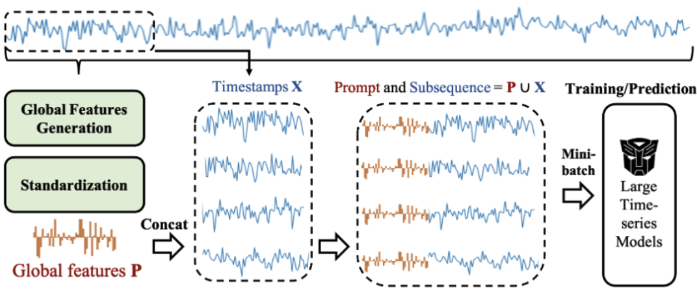

# Time Series Prompt Generator


Time series prompts are designed to capture the extensive characteristics of time series data comprehensively. These prompts, distinct from text-based ones, are created by extracting a wide range of global features from the entire training dataset. This method ensures a robust representation of the underlying dynamics, essential for boosting model performance.

## Quick Start
**Step 1.** Download the dataset from our [Google Drive](). Make sure your local data folder like this:
````angular2html
- ltsm/
    - datasets/
        electricity/
        ETT-small/
        exchange_rate/
        illness/
        traffic/
        weather/
    ...
````

**Step 2.** Generating the time series prompts from training, validating, and testing datasets
````angular2html
python prompt_generate_split.py
````

**Step 3.** Find the generated time series prompts in the './prompt_data_split' folder. Then run the following command for normalizing the prompts:
````angular2html
python prompt_normalization_split.py --mode fit
````

**Step 4.** Run this command to export the prompts to the "./prompt_data_normalize_split" folder:
````angular2html
python prompt_normalization_split.py --mode transform
````